# Langkah Langkah Pratikum

## Pemakaian Alert sebagai property window.

- Input
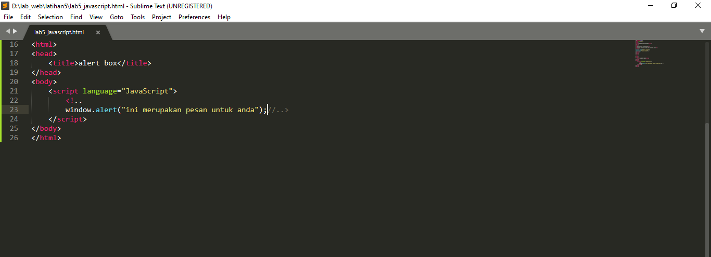

## Pemakaian method dalam objek

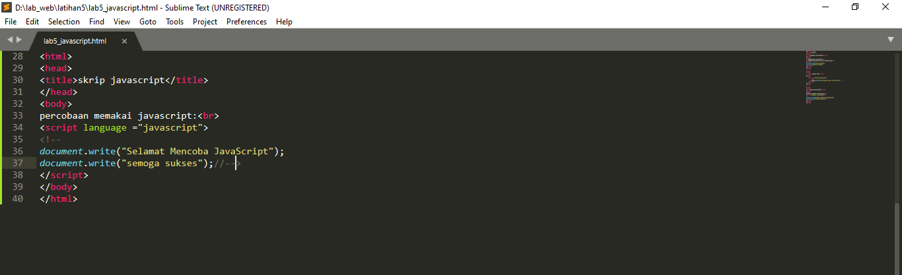

-Output
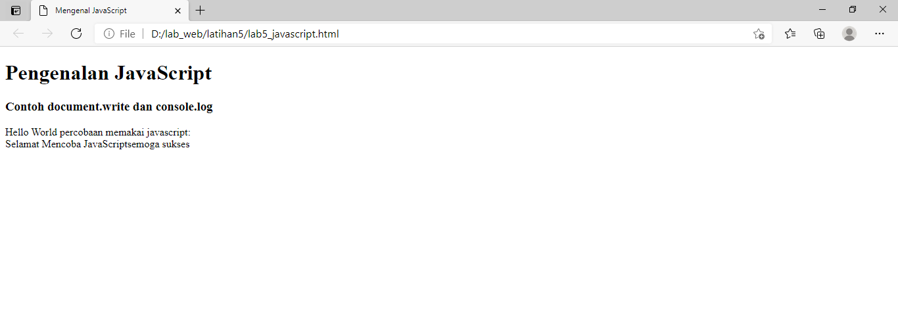

## Pemakaian Prompt

- input
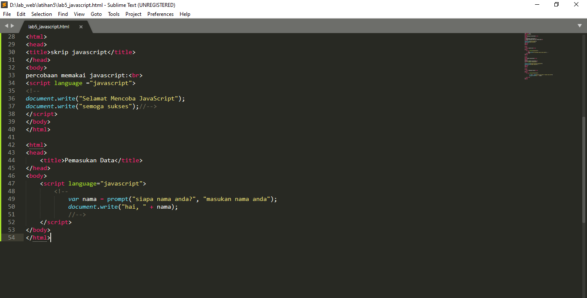

-output
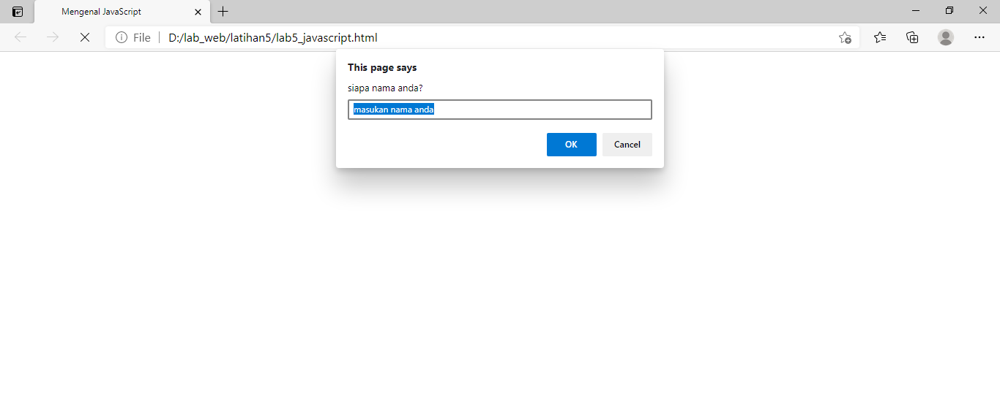

## Pembuatan fungsi dan cara pemanggilannya

- input
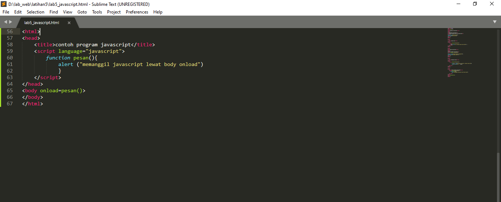

-output
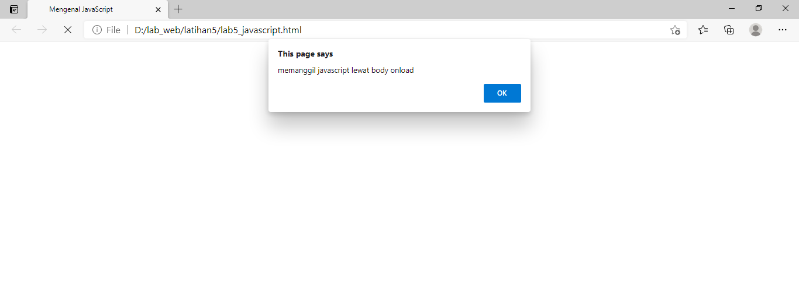

## Operasi dasar aritmatika

- input
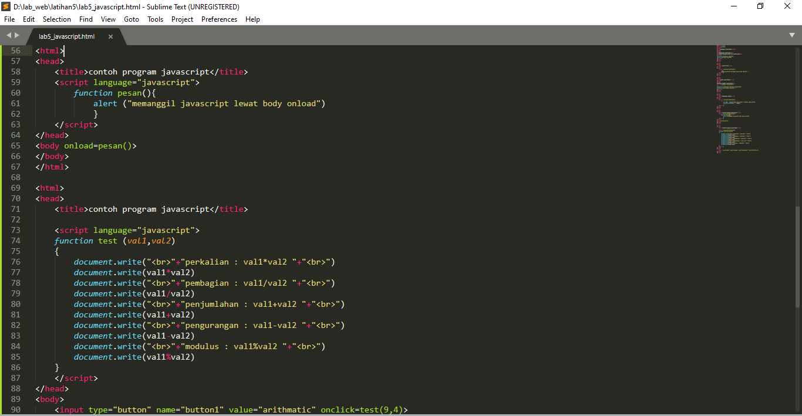

-output
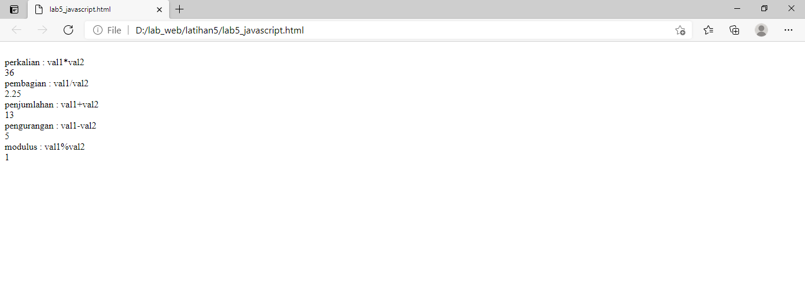

## Seleksi kondisi (if..else)

-input
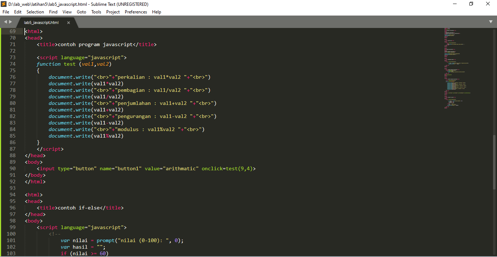

-output
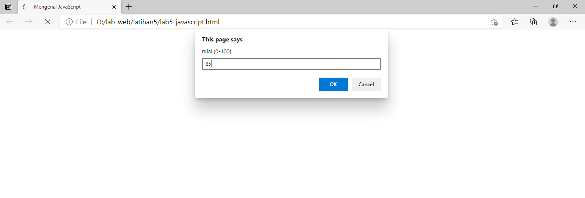
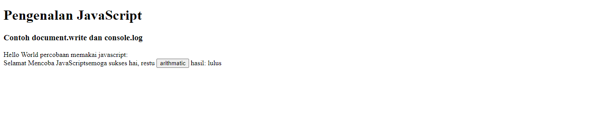

## Penggunaan operator switch untuk seleksi kondisi

-input
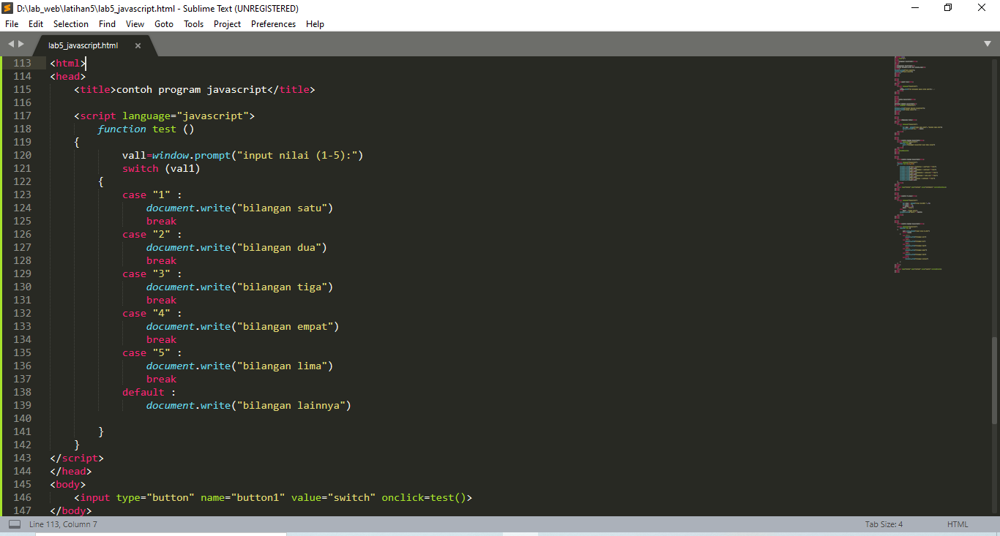

-output
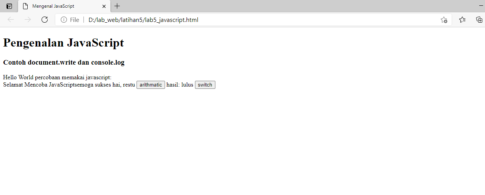

## Pembuatan Form

